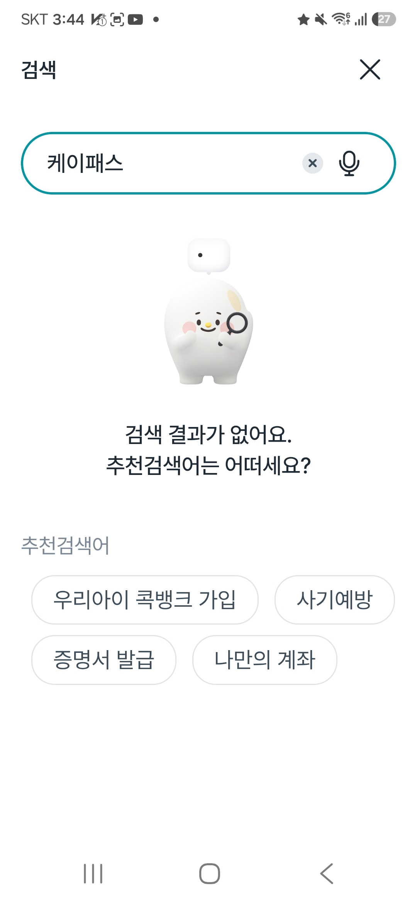
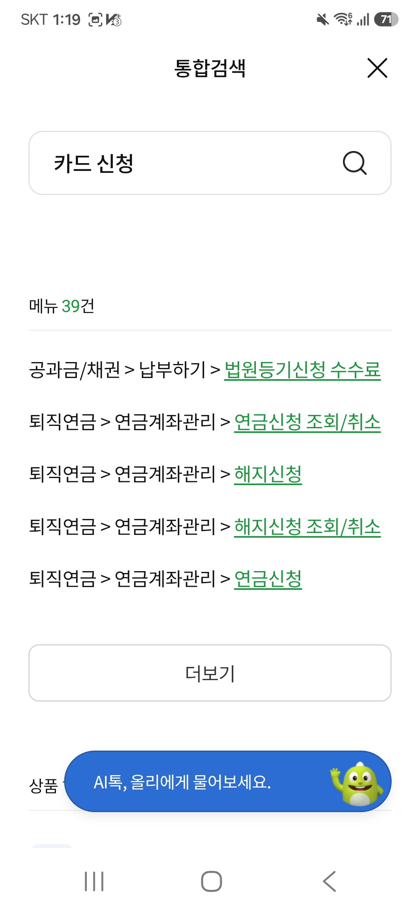
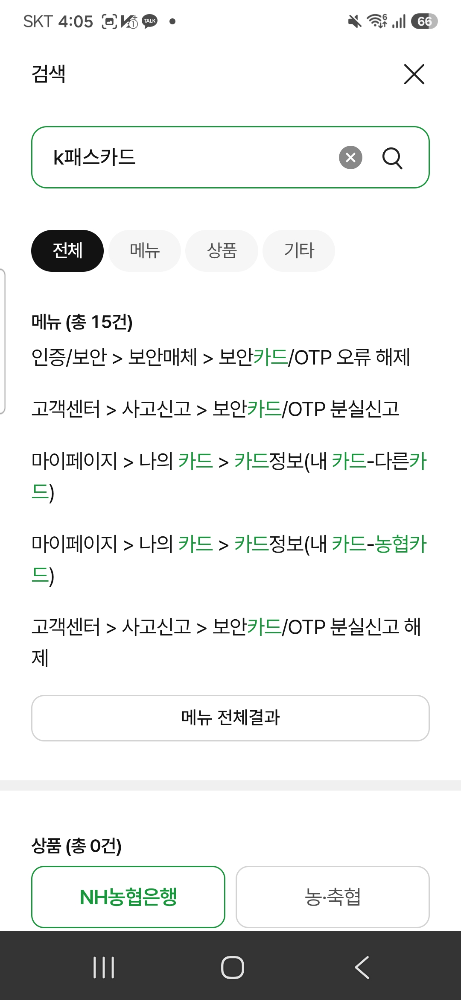
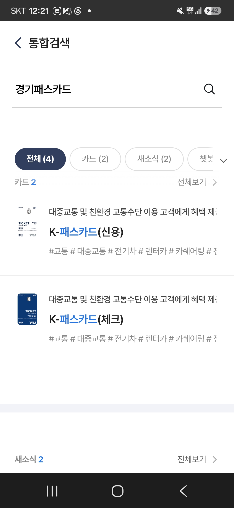

# 담당 채널 안내 기능

**은행 앱에서 상품명을 정확히 알고 검색해도 아무것도 안 나온다.** 검색 성능 문제가 아니라, 그 업무를 **어느 앱이 담당하는지 아무도 알려주지 않는** 문제였다. 검색 결과 위에 `어느 채널에서, 거기서 무엇을` 한 줄을 얹는 기능을 기획하고, 계열사 앱이 거의 부담하지 않는 방식으로 **실제 동작하게** 구현했다.

- **1인 프로젝트** · 2026-08-18 ~ 08-28 · 신입 PO·기획 포트폴리오 (0→1 기능 기획 + 검증)
- **역할** — 문제 정의 · 도메인 리서치 · 사용자 조사 · 기능 설계 · 프로토타입 구현 · 검증 설계 전부
- **한계를 먼저** — 안내가 사용자를 실제로 돕는지는 **검증하지 못했다.** 왜 못 했고 대신 무엇을 설계했는지는 [평가 리포트](./docs/평가리포트.md)에 있다.

---

## 문제 — 같은 목적, 앱마다 다른 결과

NH 앱 네 개에서 `K-패스카드`(교통비 환급 카드)를 직접 검색해 기록한 실제 화면이다.

| NH콕뱅크 | NH올원뱅크 | NH스마트뱅킹 | NH Pay |
|---|---|---|---|
|  |  |  |  |
| `"케이패스"` → **결과 0건** | `"카드 신청"` → **39건 전부 무관**<br>(법원등기 · 퇴직연금) | `"k패스카드"` → **상품 0건** | `"경기패스카드"` → **정확히 매칭** |
| 검색 대상에 없음 | 관련도 실패 | 관련도 실패 | 성공 — 그런데 |

**NH Pay가 맞은 건 검색이 뛰어나서가 아니다.** 카드가 원래 그 앱 데이터라 우연히 들어 있었을 뿐이다. 즉 **데이터가 우연히 있는 곳만 맞는다.**

근본 원인은 조직 경계다. 콕뱅크(농협중앙회 상호금융)와 올원뱅크·스마트뱅킹(NH농협금융지주 농협은행)은 **감독 체계가 다른 별도 법인**이고, 같은 은행 안에서도 카드 사업부문이 달라 NH Pay가 따로 있다. **담당 채널은 검색 데이터가 아니라 조직 데이터**라서, 각 앱의 검색 품질을 올려도 풀리지 않는다.

사용자 쪽에서도 같은 게 보였다 (담당경로 인식설문 25건):

```
앱을 먼저 여는 15명 중 담당 앱(NH Pay)을 고른 사람          1명
같은 15명 중 담당 앱이 아닌 것을 고르고 확신도 4~5           7명
못 찾으면 포털로 나가겠다고 답한 사람 (25명 중)             15명
```

## 만든 것 — 지능은 중앙에, 앱은 조회만

```
[계열사 담당자]        [라우터 콘솔]              [발행 스냅샷]           [계열사 앱]
상품·업무 데이터   →   자동 매핑                →  routing-index.json  →  routing-client.js
내보내기(CSV/TSV)      역할·다음 행동만 수기        version + etag         sync()   하루 1회
                       정규화 · 표현 확장          index / functions      lookup() 검색마다
                       중앙 검수 후 승인 · 발행     (승인된 것만)          네트워크 0
```

**검색을 고치지 않는다.** 검색 결과 위에 안내만 얹는다. 동의어 판단도, 담당 채널 판단도, 어느 앱에서 안내를 숨길지도 전부 라우터가 발행 시점에 끝내고 스냅샷에 담아 보낸다.

계열사 앱이 치르는 비용을 측정값으로 못박았다.

```
앱이 심는 코드                        4줄
검색 한 번이 쓰는 네트워크              0 B
하루 1회 변경 확인 — 안 바뀌면          304 · 수신 0 B
조회 1회 (명부 크기와 무관)             0.0002 ms
계열사가 손으로 채우는 칸               2개  (채널 역할 · 다음 행동)
자동 검사                             전부 통과 — 아래 명령으로 직접 확인
```

## 실행

서버 없이 파일을 직접 열면 된다. **두 파일을 탭 두 개로** 열어야 연동이 보인다.

```
prototype/router/console.html     라우터 관리 콘솔 — 기준 등록 · 승인 · 발행
prototype/router/bank-app.html    계열사 앱 시뮬레이터 — 검색 · 동기화 · 계측
```

```bash
node prototype/router/tests.mjs   # 외부 라이브러리 없음. 건수와 항목은 실행하면 나온다
```

시연 흐름은 `콕뱅크에서 "k패스카드" 검색 → 0건` → `콘솔에서 등록 · 승인 · 발행` → `앱에서 동기화 → 같은 검색어에 안내가 붙는다` → `한 번 더 동기화 → 304 · 수신 0 B`다. 전체 검증 절차 10단계와 측정 방법은 [라우터 README](./prototype/router/README.md)에 있다.

## 확인한 것과 확인하지 못한 것

|  | 내용 |
|---|---|
| **확인함** | 문제의 크기 — 네 앱 실측, 인식설문 25건 |
| **확인함** | 도입 비용 — 호출부 4줄, 검색당 0 B, 손으로 채우는 칸 2개 |
| **확인 못함** | **안내의 사용자 효과** — 실험군 2명, 대조군 없음 |
| **확인 못함** | 다른 저빈도 기능으로의 재현성 — K-패스카드 한 사례뿐 |

Before(포털까지 열어둔 자유 탐색)와 After를 하나의 개선율로 계산하지 않았다. **조건을 맞추면 재려던 행동이 사라지고, 맞추지 않으면 비교가 안 되기 때문**이다. 그래서 실험실 비교를 포기하고 배포 후 실사용 로그(안내 노출 후 재검색률 + 앱별 스냅샷 반영 시점을 달리한 자연 비교군)로 재는 설계로 바꿨다. 근거는 [평가 리포트](./docs/평가리포트.md)와 [결정 기록](./docs/decision-log/After검증_실사용로그전환.md)에 있다.

## 보는 순서

| 시간 | 볼 것 |
|---|---|
| **3분** | 이 문서 → [발표 자료](./prototype/slides/발표자료.html) (표지 + 8장, 브라우저로 열면 됨) |
| **10분** | 위 + [평가 리포트](./docs/평가리포트.md) — 지표 · 실패 원인 · 트레이드오프 · 한계 |
| **직접 만져보기** | [라우터 README](./prototype/router/README.md) 「실행」과 「검증」 |
| **판단 과정** | [PROJECT_GUIDE.md](./PROJECT_GUIDE.md) 확정 사항 · [decision-log](./docs/decision-log/) · [KPT 회고](./260828_KPT회고.md) |
| **디자인 판단** | [디자인 기준](./docs/디자인_기준.md) — 네 앱 실측 토큰 · 접근성 대비 · 상표 요소 취급 |

## 저장소 구조

```
README.md              이 문서
PROJECT_GUIDE.md       문제 정의 · 확정 사항 · 미확인 사항의 단일 기준
260828_KPT회고.md      회고
docs/                  조사 · 분석 · 제출 문서
  decision-log/        왜 그렇게 정했는지에 대한 결정 기록
prototype/
  router/              실동작 결과물 (콘솔 · 앱 시뮬레이터 · 클라이언트 · 자동검사)
  slides/              발표 자료
raw/                   원본 자료 — 과제 원본 · 설문 응답 · 앱 검색 캡처 (수정하지 않음)
_meta/                 진행 상태 · 인수인계 기록
_done/                 종료된 계획 문서와 폐기한 프로토타입
생각정리노트.md         as-is 조사하며 남긴 원본 메모
WORKSPACE_RULES.md     작업 규칙
NAMING.md              파일명 규칙
```

## AI와 함께 작업한 범위

이 프로젝트는 Claude Code와 함께 진행했다. **방향과 제약**(실제로 동작할 것 · 계열사가 추가로 해야 할 일을 최소화할 것)**은 내가 정했고**, 조회 구조나 데이터 전달 방식 같은 기술적 선택은 AI가 검토해 고른 안을 내가 판단해 채택했다. 문서도 상당 부분 AI와 함께 썼고, 사실·판단이 어긋난 곳은 직접 고쳤다. 그 과정에서 알게 된 AI 협업의 한계는 [KPT 회고](./260828_KPT회고.md)에 적었다.

## 고지

- 이 저장소의 화면은 전부 **기획 검증용 목업**이다. **실제 NH농협 서비스가 아니며 NH농협과 무관하다.** 실제 계좌·카드 신청은 일어나지 않고 개인정보를 수집하지 않는다.
- as-is 검색 결과는 2026-08-18~20에 본인이 실제 앱에서 검색해 기록한 값이다.
- `raw/`의 설문 원자료에는 응답자를 식별할 수 있는 정보가 들어 있지 않다.
